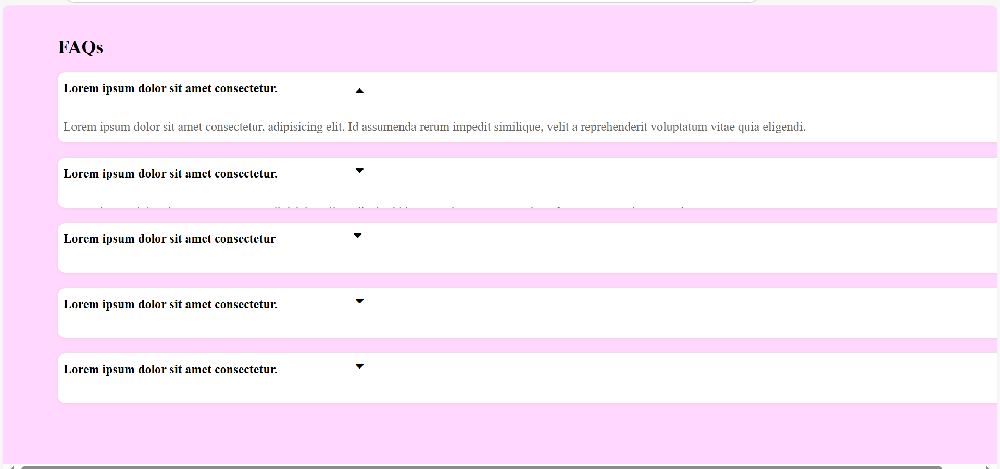

# FAQ Accordion UI with JavaScript

This is a simple and responsive FAQ (Frequently Asked Questions) Accordion built using **HTML**, **CSS**, and **Vanilla JavaScript**.

Each FAQ item expands on click to reveal the answer and collapses again on another click. The arrow icon rotates for a visual cue, and the answer area animates smoothly using CSS transitions.

---

## 🚀 Features

- Click-to-toggle accordion answers
- Smooth CSS transitions for open/close
- Rotating arrow icon animation
- Clean and modern UI
- Fully responsive layout
- Written in pure HTML, CSS, and JavaScript (no libraries)

---

## 📸 Screenshot

---

## 🛠️ Tech Stack

- HTML5
- CSS3 (Flexbox, transitions)
- JavaScript (DOM manipulation, event listeners)

---

## 🧠 What I Learned

- How to use `classList.toggle()` for dynamic interactivity
- How to animate show/hide using `max-height` instead of `display`
- How to add interactive icon rotation using Font Awesome
- How to create reusable accordion UI components

---

## 📂 Folder Structure

📁 FAQ-Accordion-Project/
│
├── index.html
├── style.css
├── script.js
└── README.md

---

## 📌 How to Run

1. Clone the repository
2. Open `index.html` in any browser
3. Click on any question to reveal the answer!

---

## ✅ Live Demo

> *(If deployed on GitHub Pages or Netlify, paste the link here)*  
Example: [Live Demo](https://yourusername.github.io/faq-accordion)

---

## 🙌 Contribution

Pull requests are welcome! For major changes, please open an issue first to discuss what you would like to change.

---

## 📃 License

This project is open-source and available under the [MIT License](LICENSE).

---

